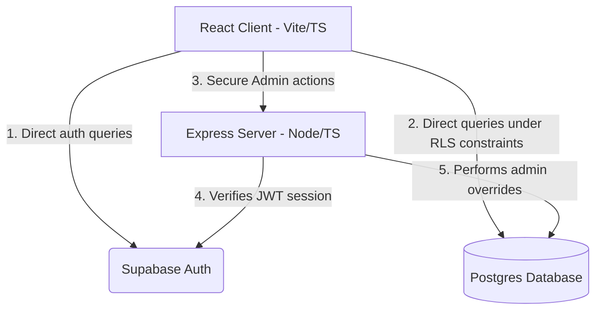

# AssetFlow — Technical Documentation (Phase 1: Foundation)

This document contains detailed information about **what work has been done** to lay the foundation of the AssetFlow ERP system.

---

## 1. System Architecture Diagram



---

## 2. Database Schema (`supabase/migrations`)

We created a database migration script [schema.sql](file:///d:/Projects/Hackthons/Odoo%20Hack/Bytecrushers/supabase/migrations/20260712000000_schema.sql) with the following structure:
- **`departments` table**: Tracks name, unique code, `head_id` (FK referencing employees), `parent_department_id` (self-referencing FK for organizational structure), and `employee_count`.
- **`employees` table**: Tracks name, email, department, role (Employee, DepartmentHead, AssetManager, Admin), status (Active, Inactive), and `auth_user_id` (FK to Supabase `auth.users`).
- **`asset_categories` table**: Tracks category name and custom field specifications as a JSONB array.
- **Triggers**:
  - `on_auth_user_created`: Automatically inserts a corresponding employee profile with the `Employee` role whenever a user signs up.
  - `tr_employees_dept_count`: Automatically updates department `employee_count` when employees are added, removed, or transferred.
- **Row-Level Security (RLS) Policies**:
  - `employees`: Admin can read/write all. Dept Head can view their own department's employees. Asset Managers can view all. Standard employees can view only their own profile.
  - `departments`: Admin can read/write all. Dept Head and Employees can view only their own assigned department.
  - `asset_categories`: Admin can read/write all. All logged-in employees can read category lists.

---

## 3. Node.js + Express + TypeScript Backend API (`backend/`)

We implemented the backend server in TypeScript:
- **Server Entrypoint**: [index.ts](file:///d:/Projects/Hackthons/Odoo%20Hack/Bytecrushers/backend/src/index.ts) manages port bindings, CORS, and registers public routes (`/api/me`) and administrative routes.
- **Client wrappers**: [supabase.ts](file:///d:/Projects/Hackthons/Odoo%20Hack/Bytecrushers/backend/src/lib/supabase.ts) uses environmental variables to create standard and admin-level Supabase clients.
- **Auth & RBAC Middleware**: [auth.middleware.ts](file:///d:/Projects/Hackthons/Odoo%20Hack/Bytecrushers/backend/src/middleware/auth.middleware.ts) retrieves the Bearer token, validates it against Supabase Auth (`supabase.auth.getUser()`), retrieves the employee rank using the admin client, checks for account deactivation, and enforces role clearance (e.g. `requireRole(['Admin'])`).
- **Admin Endpoints**: [admin.controller.ts](file:///d:/Projects/Hackthons/Odoo%20Hack/Bytecrushers/backend/src/controllers/admin.controller.ts) & [admin.routes.ts](file:///d:/Projects/Hackthons/Odoo%20Hack/Bytecrushers/backend/src/routes/admin.routes.ts) handle promotions, department assignments, category setup, and status toggles.

---

## 4. React + Vite + TypeScript Frontend Client (`frontend/`)

We constructed a dark-themed client application with:
- **Routing & Sessions**: [App.tsx](file:///d:/Projects/Hackthons/Odoo%20Hack/Bytecrushers/frontend/src/App.tsx) handles redirection gates between public pages (Login, Signup, Recovery) and protected dashboards.
- **Sign In & Registration**:
  - [Login.tsx](file:///d:/Projects/Hackthons/Odoo%20Hack/Bytecrushers/frontend/src/pages/Login.tsx): Password visible/hidden toggle, login error notifications, and local state validation.
  - [Signup.tsx](file:///d:/Projects/Hackthons/Odoo%20Hack/Bytecrushers/frontend/src/pages/Signup.tsx): Collects name metadata for profile creation, registering the user strictly as a standard `Employee`.
  - [ForgotPassword.tsx](file:///d:/Projects/Hackthons/Odoo%20Hack/Bytecrushers/frontend/src/pages/ForgotPassword.tsx): Employs Supabase's built-in reset link engine.
- **Org Setup Dashboard (Admin only)**: [OrgSetup.tsx](file:///d:/Projects/Hackthons/Odoo%20Hack/Bytecrushers/frontend/src/pages/OrgSetup.tsx) provides a 3-tab glassmorphic console:
  - **Tab A — Departments**: Form with dropdowns for department heads/parents, active status toggles, and employee counts.
  - **Tab B — Asset Categories**: Schema builder to dynamically add/remove metadata fields (Warranty, Serial numbers).
  - **Tab C — Employee Registry**: Grid layout with text search, department filter, role filter, status filter, and management actions (promoting roles or changing departments).
- **Employee Dashboard**: [EmployeeDashboard.tsx](file:///d:/Projects/Hackthons/Odoo%20Hack/Bytecrushers/frontend/src/pages/EmployeeDashboard.tsx) reads current profile statistics (assigned department, role rank, email) for standard users.

---

## 5. Local Setup and Deployment Guide

### A. Database Setup (Supabase)
1. Create a project on the [Supabase Dashboard](https://supabase.com/).
2. Open the **SQL Editor** tab from the left sidebar.
3. Paste the contents of [schema.sql](file:///d:/Projects/Hackthons/Odoo%20Hack/Bytecrushers/supabase/migrations/20260712000000_schema.sql) and click **Run**.

### B. Environment Configs
1. **Backend**: Replace the placeholders in `backend/.env` with your Supabase credentials:
   - `SUPABASE_URL`
   - `SUPABASE_ANON_KEY`
   - `SUPABASE_SERVICE_ROLE_KEY` (service_role secret)
2. **Frontend**: Replace the placeholders in `frontend/.env` with your Supabase credentials:
   - `VITE_SUPABASE_URL`
   - `VITE_SUPABASE_ANON_KEY`
   - `VITE_API_URL` (defaults to `http://localhost:5000`)

### C. Running Locally
1. Run backend server:
   ```bash
   cd backend
   npm run dev
   ```
2. Run frontend client:
   ```bash
   cd frontend
   npm run dev
   ```
3. Register at `http://localhost:5173/signup`.
4. Promote the registered user to admin via Supabase SQL Editor:
   ```sql
   update public.employees set role = 'Admin' where email = 'your-email@company.com';
   ```
5. Log back in to access the Admin Panel.
