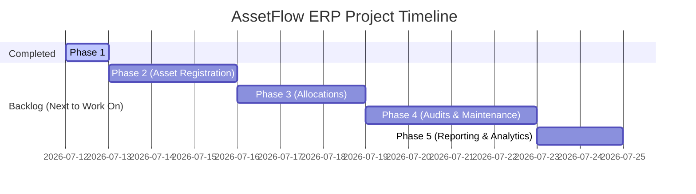

# AssetFlow — Project Roadmap & Backlog

This file outlines the future milestones and **what to work on** next to expand AssetFlow into a complete enterprise ERP.

---

## 📅 Roadmap & Future Phases

---

## 🛠️ Backlog: What to Build Next

### 1. Phase 2: Asset Registration & Category Schemes
- [ ] **Database Setup**:
  - Create an `assets` table: `id`, `name`, `serial_number`, `category_id` (FK referencing `asset_categories`), `status` (InStock, Allocated, Disposed, Maintenance), `purchase_date`, `purchase_cost`, `custom_attributes` (JSONB to store category-specific schema values).
- [ ] **Asset Management UI**:
  - Add screens for Asset Managers to register new assets.
  - Dynamically generate form input fields based on the selected category's JSONB custom fields schema built in Phase 1 (e.g. if category is Laptop, show `warranty_period` and `ram_size`).
- [ ] **Row-Level Security**:
  - Restrict write operations on the `assets` table to Asset Managers and Admins only.

### 2. Phase 3: Allocations & Request Workflows
- [ ] **Database Setup**:
  - Create a `requests` table: request status tracking (Pending, Approved, Denied, Completed), employee details, requested category, and justification.
  - Create an `allocations` table: asset reference, employee reference, allocation date, return due date, and current status (Active, Returned, Overdue).
- [ ] **Employee Request Panel**:
  - Allow standard Employees to request new assets based on category options.
- [ ] **Approval Workflows**:
  - Create dashboard tabs for Department Heads to approve or deny requests submitted by employees under their own department.
- [ ] **Allocations Console**:
  - Create a dashboard tab for Asset Managers to view approved requests and assign active assets to employees.

### 3. Phase 4: Maintenance Lifecycles & Audit Reports
- [ ] **Maintenance Tracking**:
  - Maintain logs for repair history, costs, and current maintenance status of assets.
- [ ] **Annual Auditing Tools**:
  - Create physical validation reports and verify active asset statuses.

### 4. Phase 5: Reporting & Analytics Dashboards
- [ ] Add visual charts displaying:
  - Total asset value per department.
  - Distribution of asset conditions.
  - Total depreciation schedules and maintenance costs over time.
